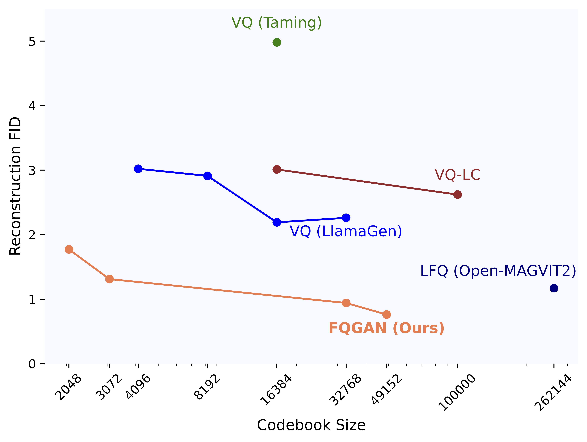
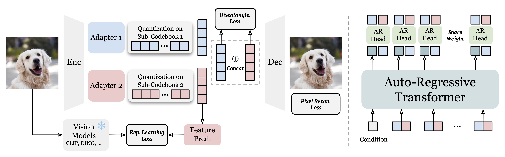
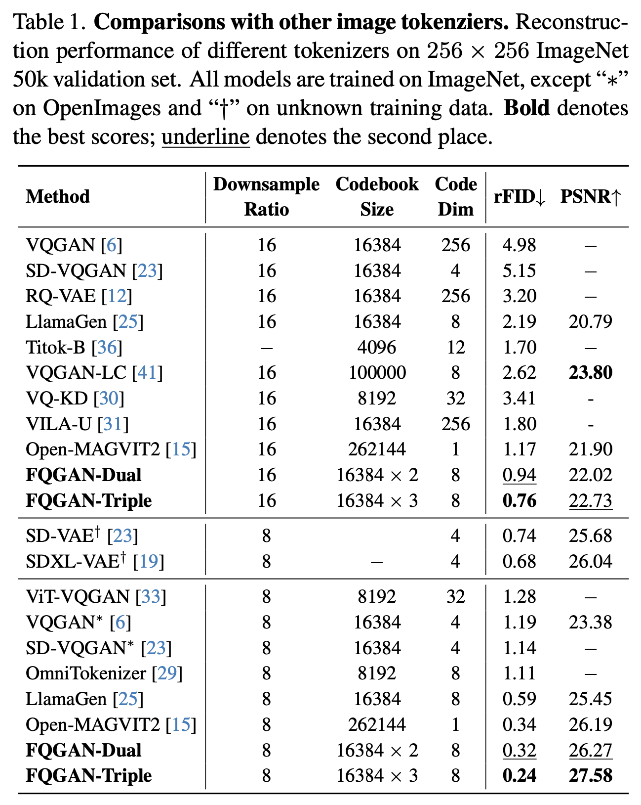
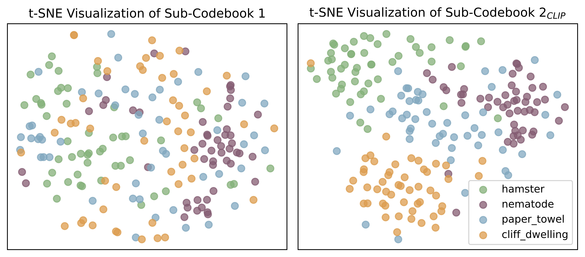
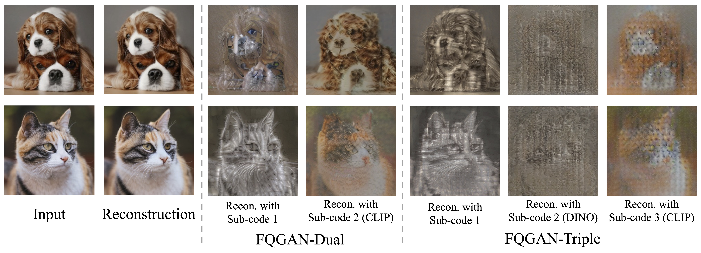
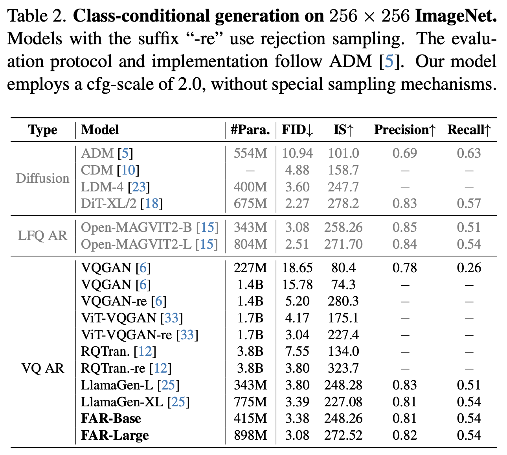

<div align="center">
<br>
<h1>Factorized Visual Tokenization and Generation</h1>

[Zechen Bai](https://www.baizechen.site/) <sup>1</sup>&nbsp;
[Jianxiong Gao](https://jianxgao.github.io/) <sup>2</sup>&nbsp;
[Ziteng Gao](https://sebgao.github.io/) <sup>1</sup>&nbsp;

[Pichao Wang](https://wangpichao.github.io/) <sup>3</sup>&nbsp;
[Zheng Zhang](https://scholar.google.com/citations?user=k0KiE4wAAAAJ&hl=en) <sup>3</sup>&nbsp;
[Tong He](https://hetong007.github.io/) <sup>3</sup>&nbsp;
[Mike Zheng Shou](https://sites.google.com/view/showlab) <sup>1</sup>&nbsp;

arXiv 2024

<sup>1</sup> [Show Lab, National University of Singapore](https://sites.google.com/view/showlab/home) &nbsp; <sup>2</sup> Fudan University&nbsp; <sup>3</sup> Amazon&nbsp;

[](https://arxiv.org/abs/2411.16681)

</div>

**News**
* **[2024-12-26]** We released our code!
* **[2024-11-26]** We released our paper on [arXiv](https://arxiv.org/abs/2411.16681).

## TL;DR
FQGAN is state-of-the-art visual tokenizer with a novel factorized tokenization design, surpassing VQ and LFQ methods in discrete image reconstruction.

<p align="center"> </p>

## Method Overview

FQGAN addresses the large codebook usage issue by decomposing a single large codebook into multiple independent sub-codebooks.
By leveraging disentanglement regularization and representation learning objectives, the sub-codebooks learn hierarchical, structured and semantic meaningful representations.
FQGAN achieves state-of-the-art performance on discrete image reconstruction, surpassing VQ and LFQ methods.

<p align="center"> </p>

## Getting Started
### Pre-trained Models
| Method       | Downsample | rFID (256x256) |                                                                             weight                                                                             |
|--------------|:----------:|:--------------:|:--------------------------------------------------------------------------------------------------------------------------------------------------------------:|
| FQGAN-Dual   |     16     |      0.94      |                           [fqgan_dual_ds16.pt](https://huggingface.co/ZechenBai/FQGAN/resolve/main/fqgan_dual_ds16.pt?download=true)                           |
| FQGAN-Triple |     16     |      0.76      |                         [fqgan_triple_ds16.pt](https://huggingface.co/ZechenBai/FQGAN/resolve/main/fqgan_triple_ds16.pt?download=true)                         |
| FQGAN-Dual   |     8      |      0.32      |                            [fqgan_dual_ds8.pt](https://huggingface.co/ZechenBai/FQGAN/resolve/main/fqgan_dual_ds8.pt?download=true)                            |
| FQGAN-Triple |     8      |      0.24      |                        [fqgan_triple_ds8_c2i.pt](https://huggingface.co/ZechenBai/FQGAN/resolve/main/fqgan_triple_ds8.pt?download=true)                        |


### Setup
The main dependency of this project is pytorch and transformers. You may use your existing python environment.

```shell
git clone https://github.com/showlab/FQGAN.git

conda create -n fqgan python=3.10 -y
conda activate fqgan

pip3 install torch==2.1.1+cu121 torchvision==0.16.1+cu121 --extra-index-url https://download.pytorch.org/whl/cu121
pip3 install -r requirements.txt
```

### Training
First, please prepare [ImageNet](https://www.image-net.org/download.php) dataset.

```shell
# Train FQGAN-Dual Tokenizer (Downsample 16X by default
bash train_fqgan_dual.sh

# Train FQGAN-Triple Tokenizer (Downsample 16X by default
bash train_fqgan_triple.sh
```

To train the FAR Generation Model, please follow the instructions in [train_far_dual.sh](train_far_dual.sh).

### Evaluation
Download the pre-trained tokenizer weights or train the model by yourself.

First, generate the reference `.npz` file of the validation set. You only need to run this command once
```shell
torchrun --nnodes=1 --nproc_per_node=8 --node_rank=0 \
--master_port=12343 \
tokenizer/val_ddp.py \
--data-path /home/ubuntu/DATA/ImageNet/val \
--image-size 256 \
--per-proc-batch-size 128
```

**Evaluate FQGAN-Dual model**
```shell
torchrun \
  --nnodes=1 --nproc_per_node=8 --node_rank=0 \
  --master_port=12344 \
  tokenizer/reconstruction_vq_ddp_dual.py \
  --data-path /home/ubuntu/DATA/ImageNet/val \
  --image-size 256 \
  --vq-model VQ-16 \
  --vq-ckpt results_tokenizer_image/fqgan_dual_ds16.pt \
  --codebook-size 16384 \
  --codebook-embed-dim 8 \
  --per-proc-batch-size 128 \
  --with_clip_supervision \
  --folder-name FQGAN_Dual_DS16

python3 evaluations/evaluator.py \
  reconstructions/val_imagenet.npz \
  reconstructions/FQGAN_Dual_DS16.npz
```

**Evaluate FQGAN-Triple model**
```shell
torchrun \
--nnodes=1 --nproc_per_node=8 --node_rank=0 \
--master_port=12344 \
tokenizer/reconstruction_vq_ddp_triple.py \
  --data-path /home/ubuntu/DATA/ImageNet/val \
  --image-size 256 \
  --vq-model VQ-16 \
  --vq-ckpt results_tokenizer_image/fqgan_triple_ds16.pt \
  --codebook-size 16384 \
  --codebook-embed-dim 8 \
  --per-proc-batch-size 64 \
  --with_clip_supervision \
  --folder-name FQGAN_Triple_DS16

python3 evaluations/evaluator.py \
  reconstructions/val_imagenet.npz \
  reconstructions/FQGAN_Triple_DS16.npz
```

To evaluate the FAR Generation Model, please follow the instructions in [eval_far.sh](eval_far.sh).

## Comparison with previous visual tokenizers
<p align="center"> </p>

## What has each sub-codebook learned?
<p align="center"> </p>

<p align="center"> </p>

## Can this tokenizer be used into downstream image generation?

<p align="center"> </p>
<p align="center"> </p>

## Citation
To cite the paper and model, please use the below:
```
@article{bai2024factorized,
  title={Factorized Visual Tokenization and Generation},
  author={Bai, Zechen and Gao, Jianxiong and Gao, Ziteng and Wang, Pichao and Zhang, Zheng and He, Tong and Shou, Mike Zheng},
  journal={arXiv preprint arXiv:2411.16681},
  year={2024}
}
```

## Acknowledgement
This work is based on [Taming-Transformers](https://github.com/CompVis/taming-transformers), [Open-MAGVIT2](https://github.com/TencentARC/SEED-Voken), and [LlamaGen](https://github.com/FoundationVision/LlamaGen).
Thanks to all the authors for their great works!

## License
The code is released under CC-BY-NC-4.0 license for research purpose only.
